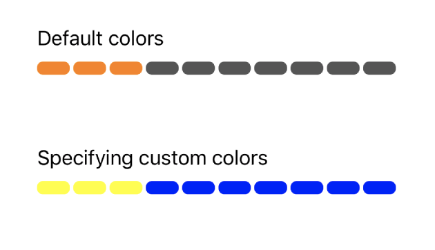

# SegmentedProgressView

[](https://cocoapods.org/pods/SegmentedProgressView)
[](https://cocoapods.org/pods/SegmentedProgressView)
[](https://cocoapods.org/pods/SegmentedProgressView)

## Example



## Usage

The class is exported as a subclass of `UIView`, and thus can be added to any view with `addSubview()`. The first initializer uses default colors of `.orange` and `.darkGray` for the filled segments and empty segments, respectively.


```swift
class ViewController: UIViewController {

    override func viewDidLoad() {
        super.viewDidLoad()
        let segmentedProgressView = SegmentedProgressView(numTotalSegments: 10,
                                                          numFilledSegments: 3,
                                                          totalViewWidth: 300)
        self.view.addSubview(segmentedProgressView)
    }
}
```

Alternatively, you can specify custom colors with the other initializer.

```swift
class ViewController: UIViewController {

    override func viewDidLoad() {
        super.viewDidLoad()
        let segmentedProgressView = SegmentedProgressView(numTotalSegments: 10,
                                                          numFilledSegments: 3,
                                                          totalViewWidth: 300,
                                                          fillColor: .yellow,
                                                          noFillColor: .blue)
        self.view.addSubview(segmentedProgressView)
    }
}
```

## Requirements
* iOS 10.0 or higher

## Installation

SegmentedProgressView is available through [CocoaPods](https://cocoapods.org). To install
it, simply add the following line to your Podfile:

```ruby
pod 'SegmentedProgressView'
```

## Author

dylandpowers, dylandpowers@gmail.com

## License

SegmentedProgressView is available under the MIT license. See the LICENSE file for more info.
